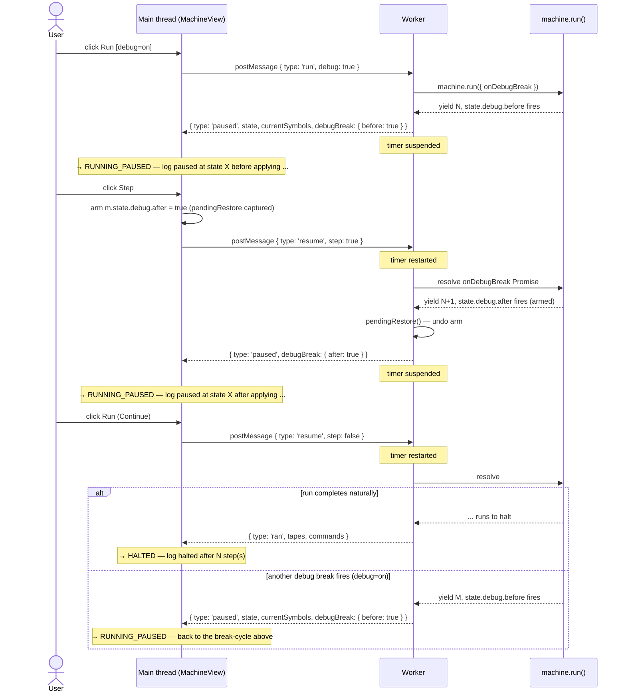

# Execution model and debugger semantics

> Canonical reference for what each mode does, what each user action triggers, and where the machine lands. Tests in [#47](https://github.com/mellonis/machines-demo/issues/47) cite the scenario IDs (`S-...`) defined throughout. Working conventions and file structure remain in [`CLAUDE.md`](../CLAUDE.md).

## 1. Overview

The demo runs user-typed JavaScript inside a Web Worker that drives a `@turing-machine-js/machine` v4 instance. The main thread tracks the worker's progress with a 7-mode state machine: three resting states (DEMO, IDLE, MANUAL), three running states (RUNNING_AUTO, RUNNING_CONTINUOUS, RUNNING_PAUSED), and one terminal (HALTED).

Most user actions are mode transitions; a few — debug toggle, withPause toggle, Apply — are flag changes or in-place mirror writes that don't move the mode.

The diagram below shows every mode-to-mode user-action edge. Conditions appear inline in `[brackets]`; alternations use `or`. Event-driven exits (run completion, error, timeout, truncation, build error) are summarized in the bottom note.


## 2. Mode reference

Three lines per mode: what it means, how it's entered, how it's exited. UI / log detail belongs in §8 Action matrix and §10 walk-throughs.

### DEMO
Page-load entry state. A timer-based loop generates random commands and applies them to the mirror, demonstrating the machine without user input. `userTookControl` is false; auto-loop is live.
Entry: page load only.
Exit: Build (→ IDLE), Step or Run (→ RUNNING_*; cold-start path), Take Control (→ MANUAL).

### IDLE
Uncommitted resting state. The user has signaled intent (Build / Step / Run from DEMO, or completed a run from IDLE-track) but has not yet taken control. Auto-loop is dead. Apply is hidden. Take Control is visible.
Entry: Build / Step / Run from DEMO; post-RUNNING_* completion when `!userTookControl`; Build from HALTED when `!userTookControl`.
Exit: Build (→ IDLE, reload), Take Control (→ MANUAL), Step (→ RUNNING_PAUSED), Run (→ RUNNING_AUTO / RUNNING_CONTINUOUS).

### MANUAL
Committed resting state. The user drives the machine via Apply. Worker is built but idle (no run/step pending). Take Control is hidden (already taken).
Entry: Take Control from any non-MANUAL mode; post-RUNNING_* completion or Build from HALTED when `userTookControl`.
Exit: Step / Run via §7 cold-start (→ RUNNING_AUTO / RUNNING_CONTINUOUS / RUNNING_PAUSED), Build (→ MANUAL, reload), Apply (stays MANUAL, writes to mirror).

### RUNNING_AUTO
The worker is running inside `machine.run({ onStep })` with a per-step throttle (the `withPause` interval). Belt animations follow the cadence; the user can click Pause to suspend.
Entry: Run from IDLE / MANUAL / HALTED with `withPause=on`; Continue from RUNNING_PAUSED with `withPause=on`.
Exit: Pause (→ RUNNING_PAUSED), debug break with `debug=on` (→ RUNNING_PAUSED), Stop (→ HALTED), run completion (→ HALTED), Take Control (→ MANUAL).

### RUNNING_CONTINUOUS
The worker is running inside `machine.run({ onStep })` with no throttle — snap-to-final. Belt animation is suppressed; per-step commands batch-log on completion. Same control surface as RUNNING_AUTO.
Entry: Run from IDLE / MANUAL / HALTED with `withPause=off`; Continue from RUNNING_PAUSED with `withPause=off`.
Exit: debug break with `debug=on` (→ RUNNING_PAUSED), Stop (→ HALTED), run completion (→ HALTED), Take Control (→ MANUAL).

### RUNNING_PAUSED
The worker is suspended inside `machine.run()` awaiting a `resume` message from the main thread. Reachable from any RUNNING_* mode via debug break, click-pause, or cold-start arming. The button labeled "Run" elsewhere reads "Continue" here.
Entry: cold-start Step (arms `initialState.debug.after`); break fires from RUNNING_AUTO / RUNNING_CONTINUOUS with `debug=on`; click-pause from RUNNING_AUTO; Step self-loop from RUNNING_PAUSED.
Exit: Step (arm next `.after`, → RUNNING_PAUSED via re-pause), Continue (→ RUNNING_AUTO / RUNNING_CONTINUOUS for the duration of the resume), Stop (terminate worker → HALTED), Take Control (→ MANUAL).

### HALTED
Terminal state. The machine reached its halt state, errored, timed out, or hit `MAX_STEPS` truncation. Tape is frozen at the final state. Build / Step / Run reload-from-code. Take Control is visible only when `!userTookControl`.
Entry: run completion, Stop, error, timeout, or truncation from any RUNNING_*; build error from any cold-start.
Exit: Build (→ IDLE if `!userTookControl`, → MANUAL if `userTookControl`), Step / Run (→ RUNNING_* via cold-start), Take Control (→ MANUAL, only if `!userTookControl`).

## 3. Flag reference

Four flags govern transitions and per-action behavior. Three are user-visible UI controls; one is a sticky latch.

- **`debugMode`** — `boolean`. UI checkbox in the Toolbar, persisted to `localStorage:machines-demo:<engine>:debugMode`. Gates whether user-authored `state.debug` / `haltState.debug` breaks pause execution. Mid-run toggle pushes `setDebug(on)` to the worker (the only mode-aware effect on a flag toggle).
- **`withPause`** — `boolean`. UI checkbox + interval input in the Toolbar. Selects RUNNING_AUTO (with throttle) vs RUNNING_CONTINUOUS (snap-to-final) on the next Run. The toggle itself (`S-withpause-toggle`) has no immediate runtime effect; it's read at Run-click time.
- **`halted`** — `boolean`. Derived from worker `built` / `ran` / `error` responses. Drives the HALTED-mode transition.
- **`userTookControl`** — `boolean`. Sticky latch, starts `false`, set `true` on Take Control click, never re-enables. Marks the "manual track": after RUNNING_* / HALTED, post-action mode resolution lands MANUAL when true, IDLE when false.

The `demoEnabled` flag from earlier versions of the code is dropped — the DEMO ↔ IDLE mode distinction encodes "is the auto-loop alive" directly.

## 4. DEMO mode

DEMO is the page-load entry state — a teaser that shows the machine reacting to inputs without requiring the user to do anything. The demo loop fires on a timer (~1 Hz) and applies one randomly chosen command per tick, drawn from the current tape's alphabet (40 % chance the head stays put with no write; otherwise pick a random symbol and a random direction).

The loop is entirely a main-thread effect; the worker doesn't see DEMO. The mirror machine receives commands directly via the same `ifOtherSymbol` one-step path used by Apply.

**Exits.** DEMO → IDLE on Build / Step / Run (cold-start path; the click signals intent and kills the loop); DEMO → MANUAL on Take Control (the user commits to the manual track). Errors during cold-start lead → HALTED via the cold-start error branch.

**Visible controls.** Build, Step, Run, Take Control. Apply is hidden (the loop generates commands itself; there's no role for a user-fired Apply in DEMO). Stop is hidden (no worker-side run to interrupt).

**Scenario IDs.**
- `S-build-demo` — reload, → IDLE.
- `S-step-demo-{off,on}` — cold-start Step. Worker arms `initialState.debug.after = true`, runs, → RUNNING_PAUSED. Per §7.
- `S-run-demo-{off,on}-{auto,cont}` — cold-start Run. → RUNNING_AUTO or RUNNING_CONTINUOUS by withPause. Per §7.
- `S-takectl-demo` — `userTookControl = true`, → MANUAL.

DEMO is entered only on initial page load. After any of the exits above, the user never returns to DEMO.

## 5. IDLE mode

IDLE is the post-interaction, pre-Take-Control resting state. The user has clicked Build / Step / Run (from DEMO or after a previous run) but hasn't committed to the manual track. The auto-loop is dead; the worker is built; the panel mirrors the worker's state but is read-only.

IDLE differs from MANUAL only by the `userTookControl` latch — once Take Control fires, IDLE → MANUAL and never returns.

**Exits.** Build (→ IDLE, reload — same code, fresh worker); Step / Run (→ RUNNING_*; cold-start path); Take Control (→ MANUAL, latch flips). Errors during cold-start lead → HALTED via the cold-start error branch.

**Visible controls.** Build, Step, Run, Take Control. Apply is hidden (Apply is MANUAL-only). Stop is hidden (no run in flight).

**Scenario IDs.**
- `S-build-idle` — reload, → IDLE.
- `S-step-idle-{off,on}` — cold-start Step. Per §7.
- `S-run-idle-{off,on}-{auto,cont}` — cold-start Run. Per §7.
- `S-takectl-idle` — `userTookControl = true`, → MANUAL.

A user who has run a machine to completion without ever clicking Take Control returns to IDLE — the spec preserves the IDLE track until the user explicitly opts in to MANUAL.

## 6. MANUAL mode

MANUAL is the committed resting state. `userTookControl = true`; the user is driving the machine via Apply. The panel is enabled and the user composes a `Command` (movement + symbol) which writes to the mirror via the same `ifOtherSymbol` one-step state used internally by Step.

Once entered, MANUAL is sticky: subsequent Build / Step / Run / completion all return to MANUAL.

**Exits.** Build (→ MANUAL, reload); Step / Run (→ RUNNING_*; cold-start); Apply (stays MANUAL, in-place mirror write). Errors during cold-start lead → HALTED.

**Visible controls.** Build, Step, Run, Apply. Take Control is hidden (already taken). Stop is hidden (no run in flight).

**Apply scenario.**
- `S-apply-manual` — main thread applies the user-composed `Command` to `mirrorMachine` via the `ifOtherSymbol` one-step state. No worker round-trip; the worker stays idle. Mode stays MANUAL. The log gets a single command entry per Apply.

The Apply button is **hidden** in DEMO, IDLE, and HALTED — it's MANUAL-only. Earlier code variants displayed a flashing "next random command" Apply button in DEMO; the spec drops that affordance and lets the DEMO loop render its commands inline on the panel.

**Cold-start scenarios from MANUAL.** See §7.
- `S-build-manual` — reload, → MANUAL.
- `S-step-manual-{off,on}` — cold-start Step.
- `S-run-manual-{off,on}-{auto,cont}` — cold-start Run.

## 7. Starting and resuming runs

The cold-start path (Build / Step / Run from IDLE, MANUAL, or HALTED — and DEMO's user-clicked equivalent) is unified: reload the worker, then either land back in a resting mode (Build) or enter `machine.run()` (Step / Run). The Resume sub-section covers Continue from RUNNING_PAUSED, which uses the same in-flight `run()` rather than reloading.

### Cold-start

The path is identical from IDLE, MANUAL, and HALTED. Each Build / Step / Run reloads the worker, builds a fresh mirror, then routes by action:

- **Build** — reload only. → IDLE if `!userTookControl`, → MANUAL if `userTookControl`.
- **Step** — reload, arm `initialState.debug.after = true` (preserving any user-authored `state.debug.before`), call `runner.run({ debug: debugMode, step: true })`. Worker pauses at iter 1's after-fire → RUNNING_PAUSED. With `debug=on` and a user-authored `state.debug.before` on `initialState`, the before-fire interposes first; same target mode.
- **Run** — reload, call `runner.run({ debug: debugMode })`. → RUNNING_AUTO (`withPause=on`, with throttled `onStep`) or RUNNING_CONTINUOUS (`withPause=off`, no throttle). Debug breaks during the run land → RUNNING_PAUSED.

If the reload itself fails (build error in user code), → HALTED with an error log; covered by walk-through 7.

```mermaid
flowchart TD
    Start([User clicks Build, Step, or Run from IDLE / MANUAL / HALTED])
    Start --> Reload[reload worker — build, mirror, alphabets]
    Reload --> Action{which action?}
    Reload -. build error .-> ErrorOut[→ HALTED with error log]
    Action -->|Build| Resolve1{userTookControl?}
    Resolve1 -->|true| ManualOut[→ MANUAL]
    Resolve1 -->|false| IdleOut[→ IDLE]
    Action -->|Step| ArmAfter[arm initialState.debug.after = true; preserve user-authored .before]
    ArmAfter --> RunStep[runner.run debug=debugMode, step=true]
    RunStep --> PauseOut[→ RUNNING_PAUSED at iter 1 after-fire]
    Action -->|Run| WithPause{withPause?}
    WithPause -->|true| RunAuto[runner.run debug=debugMode, with throttled onStep]
    RunAuto --> AutoOut[→ RUNNING_AUTO]
    WithPause -->|false| RunCont[runner.run debug=debugMode, no throttle]
    RunCont --> ContOut[→ RUNNING_CONTINUOUS]
    AutoOut -. user-authored break .-> PauseOut
    ContOut -. user-authored break .-> PauseOut
    RunStep -. user-authored .before fires before iter 1 after .-> PauseOut
```

**Cold-start scenario IDs.** Each origin (IDLE / MANUAL / HALTED) gets the same set:

- `S-build-{idle,manual,halted}` — reload, → IDLE / MANUAL by `userTookControl`.
- `S-step-{idle,manual,halted}-{off,on}` — Step cold-start. Off / on selects `debug` flag.
- `S-run-{idle,manual,halted}-{off,on}-{auto,cont}` — Run cold-start. Off / on selects `debug`; auto / cont selects `withPause`.

**DEMO origin.** Build / Step / Run from DEMO uses the same cold-start path; the click signals intent (kills the auto-loop) but doesn't flip `userTookControl`, so post-RUNNING_* completion and Build resolution land IDLE. Scenario IDs `S-build-demo`, `S-step-demo-{off,on}`, `S-run-demo-{off,on}-{auto,cont}` mirror the IDLE entries.

**Post-RUNNING_* completion** — when a run reaches halt naturally (or via Stop), the resolution is HALTED. The next Build / Step / Run from HALTED then resolves to IDLE or MANUAL by `userTookControl`. The track is preserved across the run.

### Resume from PAUSED

The Run / Continue button (Run while in RUNNING_PAUSED) doesn't reload — it sends `runner.resume({ step: false })` and the worker continues inside the same in-flight `machine.run()` invocation. Two outcomes by `debug`:

- `S-continue-paused-off` — `runner.resume({ step: false })`. Debug breaks are not honored (worker-side `debugEnabled = false`), so the run continues to halt → HALTED on completion. Stop / error / timeout still terminate the worker normally.
- `S-continue-paused-on` — `runner.resume({ step: false })`. Debug breaks fire as encountered → next RUNNING_PAUSED. The user can click Continue again, repeating across multiple paused / resume cycles until halt or Stop.

The button's label changes by mode: "Run" in non-PAUSED modes (cold-start), "Continue" in RUNNING_PAUSED. Same underlying action class; the label just clarifies intent.

Walk-through 3 expands these scenarios with per-segment timer behavior, log replay, and edge cases.

## 8. Action matrix

Mode-transition outcomes for user actions across the three running / paused modes. Each cell is a scenario ID + one-line outcome, or `—` for hidden / disabled.

**Matrix scope.** The matrix lists *user-action* exits only. Event-driven transitions — debug break firing, run completion, error, timeout, truncation — are not matrix rows. They appear in three other places: §1's master state diagram (edges), each mode's "Exit" line in §2 Mode reference, and walk-throughs 2 and 7-9. A reader looking only at the matrix should not conclude that, e.g., RUNNING_CONTINUOUS exits only via Stop or Take Control.

| Action | RUNNING_AUTO | RUNNING_CONTINUOUS | RUNNING_PAUSED |
|---|---|---|---|
| **Step (debug=off)** | `S-step-auto-off`: pause label — suspend run loop, → PAUSED | — | `S-step-paused-off`: arm `.after` on next state, resume(step), → PAUSED |
| **Step (debug=on)** | `S-step-auto-on`: pause label — suspend, → PAUSED | — | `S-step-paused-on`: arm `.after`, resume(step), → PAUSED (a user break may interpose first) |
| **Stop** | `S-stop-auto`: terminate, → HALTED | `S-stop-cont`: terminate, → HALTED | `S-stop-paused`: terminate, suppress failHalted, → HALTED |
| **Take Control** | `S-takectl-auto`: latch userTookControl=true, terminate, → MANUAL | `S-takectl-cont`: latch, terminate, → MANUAL | `S-takectl-paused`: latch, terminate, → MANUAL |

Notes:
- Every cell is a mode transition (or `—` for hidden / disabled). Flag-change actions (debug toggle, withPause toggle) live in §3 — they don't cause mode transitions.
- **Build is hidden in RUNNING_AUTO / RUNNING_CONTINUOUS / RUNNING_PAUSED** — a pending worker request blocks Build. To rebuild, the user clicks Stop or Take Control first (terminate the worker), then Build is available from HALTED / MANUAL.
- All RUNNING_* paths use `run()`. "Pause" from RUNNING_AUTO suspends inside run-mode (the throttle's setTimeout) and lands in PAUSED — the same paused state used by debug breaks.
- **RUNNING_CONTINUOUS has the same control surface as RUNNING_AUTO** — Stop, Take Control, debug toggle all available. The modes differ only in throttle / animation; the control surface does not become a third axis of difference. Take Control mid-CONTINUOUS can lose the race to completion, but no race produces a broken state — terminate-or-complete are both clean exits.
- Run / Continue is a single-column action (only meaningful from RUNNING_PAUSED). It's documented in §7 Resume from PAUSED rather than in the matrix.
- DEMO, IDLE, MANUAL, HALTED are not matrix columns — they have their own sections (§4, §5, §6, §9).

## 9. HALTED mode

HALTED is the terminal state — the machine reached its halt state, was stopped, or hit an error / timeout / `MAX_STEPS` truncation. The tape is frozen at the final state; the worker is alive but idle (no run in flight). Build / Step / Run reload-from-code; Take Control flips the latch.

**Exits.** Build (→ IDLE if `!userTookControl`, → MANUAL if `userTookControl`), Step / Run (→ RUNNING_* via cold-start, see §7), Take Control (→ MANUAL, only when `!userTookControl` — otherwise the button is hidden).

**Visible controls.** Build, Step, Run. Take Control if `!userTookControl`. Apply hidden (Apply is MANUAL-only). Stop hidden (nothing to stop).

**Scenario IDs.**
- `S-build-halted` — reload, → IDLE / MANUAL by `userTookControl`. See §7.
- `S-step-halted-{off,on}` — cold-start Step. See §7.
- `S-run-halted-{off,on}-{auto,cont}` — cold-start Run. See §7.
- `S-takectl-halted` — `userTookControl = true`, → MANUAL. Available only when `!userTookControl`.

HALTED can be reached from any non-resting state. Build / Step / Run from HALTED, plus error and timeout handling, are walk-throughs in §10.

## 10. Scenario walk-throughs

Each walk-through expands a contested or non-obvious path with sequence, log entries, worker calls, and edge cases. Boundary cases only — straightforward paths (Build, Apply, cold-start Run with no breaks) are sufficiently covered by the matrix and §7.

### `S-step-paused-off` / `S-step-paused-on` — Step from break

**Sequence**
1. User clicks Step while in RUNNING_PAUSED.
2. Main thread arms `.after` on the relevant state — `m.state` if the current pause was a `before`-fire, `m.nextState` if it was an `after`-fire. The mutation is captured in `pendingRestore` for later un-application.
3. `runner.resume({ step: true })` resolves the worker's pending Promise with the step intent.
4. Worker un-applies any prior `pendingRestore`, then runs until the armed `.after` fire (or until a user-authored break interposes when `debug=on`).
5. Worker sends `paused`; main thread enters RUNNING_PAUSED with the new break info, runs `pendingRestore` for the new arm.

**Log entries**
- `paused at state <X> after applying command for symbols: [<syms>]`

**Worker calls**
- `resume({ step: true })`

**Edge cases**
- `debug=on`: a user-authored `.before` may interpose before the armed `.after` fires. Both produce a normal `paused` response; the long-format log line distinguishes them by `before` vs `after`.
- The halting iter's armed `.after` never fires (engine quirk). If the next iter halts the machine, the worker sends `ran` instead of a final `paused` — the run lands in HALTED. Tracked in [turing-machine-js#108](https://github.com/mellonis/turing-machine-js/issues/108).

The sequence diagram below shows the complete cycle: Run (debug=on) → break → Step → re-pause → Continue → halt or further breaks.



### Walk-through 2 — Run with breakpoints (multi-paused cycle)

A Run with `debug=on` and user-authored `state.debug` triggers a sequence of paused / resume cycles. Each `paused` includes the current state, current symbols, and the `debugBreak` shape (`{ before: true }` or `{ after: true }`).

**Per-segment timer.** The worker's per-segment `WORKER_TIMEOUT_MS` (5 s) suspends on every `paused` and restarts on every `resume`-send. A user inspecting a paused state for minutes does not trigger the timeout; only worker-side execution time counts.

**Log replay.** Each `paused` carries a `commands` array — the per-step commands buffered between this `paused` and the previous one. The main thread appends them to the log in order, so the trace is preserved across pauses without the worker re-sending the full history.

**Edge case — Stop while paused.** Worker is terminated; `runner.run()` rejects; `failHalted` is suppressed via `stopRequested`. Mode → HALTED with a `stopped` log entry. See walk-through 4.

### Walk-through 3 — Continue from break (`S-continue-paused-{off,on}`)

**Sequence (debug=off).**
1. User clicks Run while in RUNNING_PAUSED. The button reads "Continue".
2. Main thread sends `resume({ step: false })`.
3. Worker resolves the pending Promise. `debugEnabled = false` so `onDebugBreak` returns immediately on subsequent breaks.
4. Run continues to halt; worker sends `ran` → HALTED.

**Sequence (debug=on).**
1. Same start.
2. Worker resolves; `debugEnabled = true` so subsequent breaks pause normally.
3. Run continues until next break (→ another `paused` → RUNNING_PAUSED again), Stop, or halt (→ HALTED).

**Log entries**
- (debug=off, halt) `halted after N step(s)`
- (debug=on, next break) — same long-format line as walk-through 1's log: `paused at state <X> {before|after} applying command for symbols: [<syms>]`

**Worker calls**
- `resume({ step: false })`

### Walk-through 4 — Stop from each running mode

Stop is visible while in RUNNING_AUTO, RUNNING_CONTINUOUS, and RUNNING_PAUSED.

- `S-stop-auto` / `S-stop-cont` — main thread calls `runner.terminate()`. Worker is killed; `runner.run()` rejects with `runner terminated`. `failHalted` runs: rebuild mirror from worker's last-known tape state (or zeroed state if none), → HALTED with `stopped` log entry.
- `S-stop-paused` — same as above, but `stopRequested` is set on the runner first so `failHalted` is **suppressed** when the rejected Promise surfaces (the rejection is the expected outcome of Stop, not an error). → HALTED with `stopped` log entry only — no error log.

**Log entries**
- `stopped`
- (state mirror snapshot in matrix view)

**Edge case.** A Stop click that races with run completion: worker may have already sent `ran` when `terminate()` is called. The runner's `runPending` slot has been cleared; `terminate()` is a no-op on the runner side. The HALTED transition still happens via the normal completion path, with a `halted after N step(s)` log entry instead of `stopped`. No user-visible bug.

### Walk-through 5 — debug toggle mid-run

The `debugMode` UI checkbox is reactive across mode transitions. A change while in any RUNNING_* mode pushes `setDebug(on)` to the worker.

- `S-debug-toggle-auto` / `S-debug-toggle-cont` — `runner.setDebug(on)` posts a fire-and-forget message. Worker flips an internal `debugEnabled` flag. Subsequent `onDebugBreak` calls honor the new value (no run restart).
- `S-debug-toggle-paused` — same `setDebug()` send. The current paused state is unaffected; the next break (after Continue) is gated by the new flag value.
- In DEMO / IDLE / MANUAL / HALTED — flag flip only; no worker call (the worker is idle, the flag is read at the next `run()`).

**Log entries**
- (none — toggle is silent)

**Edge case.** Toggling debug=on while paused doesn't cause an immediate break — the user is already paused. After Continue, breaks fire normally.

### Walk-through 6 — Take Control mid-run

Take Control is visible in DEMO, IDLE (visible during cold-start RUNNING_*), HALTED (when `!userTookControl`), and any RUNNING_* mode.

- `S-takectl-auto` / `S-takectl-cont` / `S-takectl-paused` — main thread calls `runner.terminate()`. Worker is killed; `runner.run()` rejects via `rejectAll`. `userTookControl = true`. `failHalted` is suppressed via the same path as `S-stop-paused`. Mode → MANUAL.
- `S-takectl-demo` / `S-takectl-idle` — no run in flight, just latch + mode change. → MANUAL.
- `S-takectl-halted` — `userTookControl = true`, → MANUAL. Available only when `!userTookControl`.

**Log entries**
- `took control`

**Edge case.** Take Control from RUNNING_PAUSED is functionally identical to from RUNNING_AUTO / RUNNING_CONTINUOUS — the worker is paused, but `terminate()` kills it the same way. `runPending`'s onPaused callback is never called again because the runner's pending slot is cleared on terminate.
