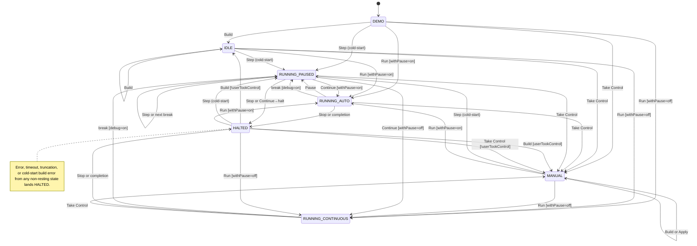

# Execution model and debugger semantics

> Canonical reference for what each mode does, what each user action triggers, and where the machine lands. Tests in [#47](https://github.com/mellonis/machines-demo/issues/47) cite the scenario IDs (`S-...`) defined throughout. Working conventions and file structure remain in [`CLAUDE.md`](../CLAUDE.md).

## 1. Overview

The demo runs user-typed JavaScript inside a Web Worker that drives a `@turing-machine-js/machine` v4 instance. The main thread tracks the worker's progress with a 7-mode state machine: three resting states (DEMO, IDLE, MANUAL), three running states (RUNNING_AUTO, RUNNING_CONTINUOUS, RUNNING_PAUSED), and one terminal (HALTED).

Most user actions are mode transitions; a few — debug toggle, withPause toggle, Apply — are flag changes or in-place mirror writes that don't move the mode.

The diagram below shows every mode-to-mode user-action edge. Conditions appear inline in `[brackets]`; alternations use `or`. Event-driven exits (run completion, error, timeout, truncation, build error) are summarized in the bottom note.

