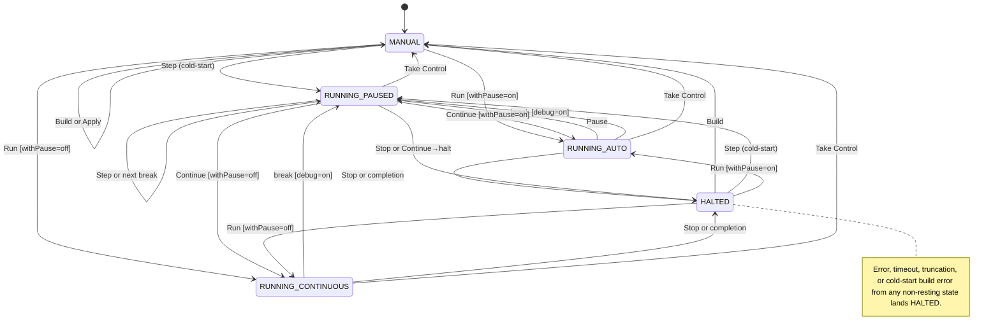
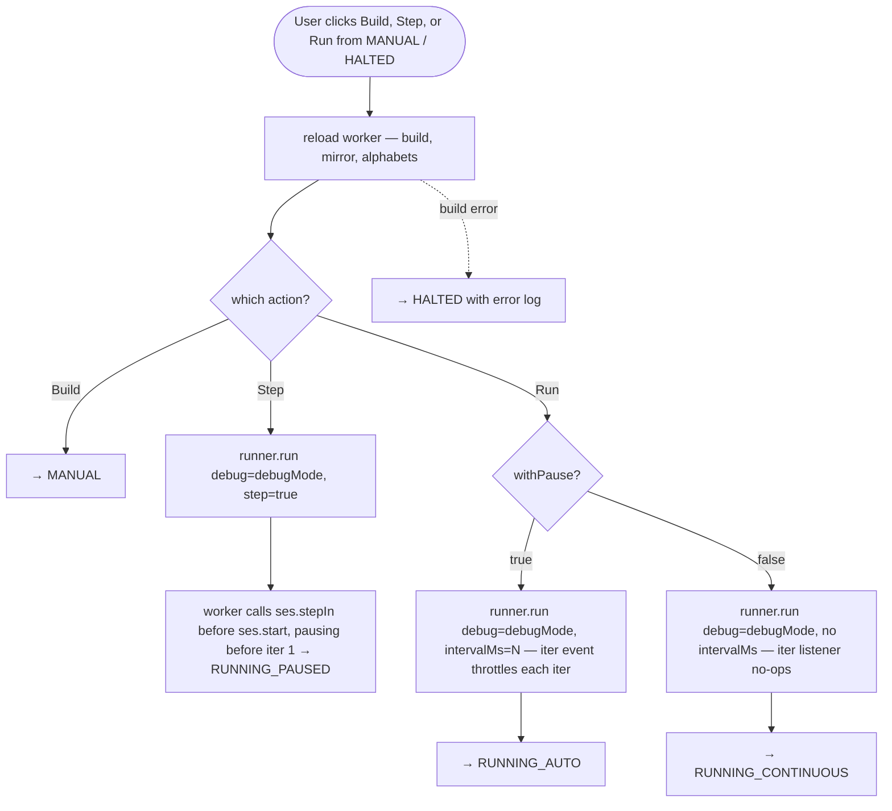
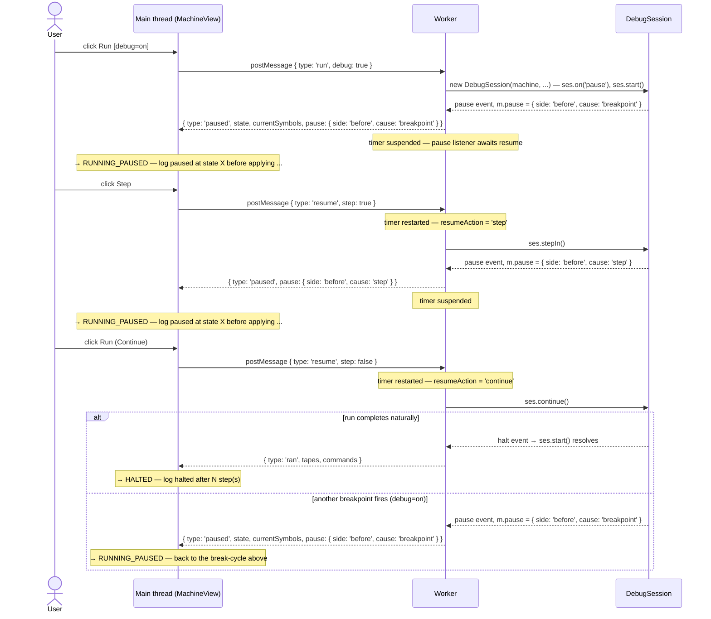

# Execution model and debugger semantics

> Canonical reference for what each mode does, what each user action triggers, and where the machine lands. Tests in [#47](https://github.com/mellonis/machines-demo/issues/47) cite the scenario IDs (`S-...`) defined throughout. Working conventions and file structure remain in [`CLAUDE.md`](../CLAUDE.md).

## 1. Overview

The demo runs user-typed JavaScript inside a Web Worker that drives a `@turing-machine-js/machine` v7.0.0-alpha.6 machine through a **`DebugSession`** ([engine #102](https://github.com/mellonis/turing-machine-js/issues/102)). The engine's v7 `run()` is sync + callback-free; all interactive observation (breakpoints, step controls, click-pause, throttle) moved into the session. The worker constructs one — `machine.debugRun(...)` for Post (returns a `PostDebugSession`), `new DebugSession(machine, ...)` for Turing — and listens to its `step` / `pause` / `iter` / `halt` events. The main thread tracks the worker's progress with a 5-mode state machine: one resting state (MANUAL), three running states (RUNNING_AUTO, RUNNING_CONTINUOUS, RUNNING_PAUSED), and one terminal (HALTED).

Engine pages (`/turing`, `/post`) mount in MANUAL. Initial editor content follows a 4-tier boot priority: `?example=<id>` query > `?snippet=<uuid>` query > localStorage `code` > first bundled example for the engine. Implementation lives in `src/lib/initialBoot.ts` as the pure helper `computeInitialBoot(...)`. No tape animation runs until the user clicks Step or Run.

Most user actions are mode transitions; a few — debug toggle, withPause toggle, Apply — are flag changes or in-place mirror writes that don't move the mode.

The diagram below shows every mode-to-mode user-action edge. Conditions appear inline in `[brackets]`; alternations use `or`. Event-driven exits (run completion, error, timeout, truncation, build error) are summarized in the bottom note.

## 2. Mode reference

Three lines per mode: what it means, how it's entered, how it's exited. UI / log detail belongs in §6 Action matrix and §8 walk-throughs.

### MANUAL
The only resting state. Worker is built but idle (no run/step pending); the user drives the machine via Apply. Engine pages mount here; every post-RUNNING_* completion and every Build lands here.
Entry: page load (initial editor content per the 4-tier boot priority — §1); Build from any mode; Take Control from any RUNNING_*; post-RUNNING_* completion path is HALTED, with the subsequent Build → MANUAL.
Exit: Step / Run via §5 cold-start (→ RUNNING_AUTO / RUNNING_CONTINUOUS / RUNNING_PAUSED), Build (→ MANUAL, reload), Apply (stays MANUAL, writes to mirror).

### RUNNING_AUTO
The worker is running inside the session's `start()` with the throttle on the awaited `iter` event (the `withPause` interval awaited at end-of-iter). Belt animations follow the cadence; the user can click Pause to suspend (the engine's external `pause()`).
Entry: Run from MANUAL / HALTED with `withPause=on`; Continue from RUNNING_PAUSED with `withPause=on`.
Exit: Pause (→ RUNNING_PAUSED), debug break with `debug=on` (→ RUNNING_PAUSED), Stop (→ HALTED), run completion (→ HALTED), Take Control (→ MANUAL).

### RUNNING_CONTINUOUS
The worker is running inside the session's `start()` with no throttle (the `iter` listener no-ops in this mode) — snap-to-final. Belt animation is suppressed; per-step commands batch-log on completion. Stop is visible as the user's kill-switch; the Step button stays rendered but disabled (no per-iter checkpoint to pause at).
Entry: Run from MANUAL / HALTED with `withPause=off`; Continue from RUNNING_PAUSED with `withPause=off`.
Exit: debug break with `debug=on` (→ RUNNING_PAUSED), Stop (→ HALTED), run completion (→ HALTED), Take Control (→ MANUAL).

### RUNNING_PAUSED
The worker is blocked inside the session's `pause` listener (the engine awaits an internal resume-promise) and the worker's own listener awaits a `resume` message from the main thread before deciding how to continue. Reachable from any RUNNING_* mode via debug break, click-pause, or cold-start Step. The Run button reads "Continue" throughout any RUNNING_* mode (disabled in AUTO/CONTINUOUS, enabled here). Build is disabled while a run is in flight (including PAUSED) — to start over the user must Stop first, then Build, which makes the worker tear-down explicit rather than silent.
Entry: cold-start Step (`run({ step: true })` arms `ses.stepIn()` before `ses.start()` → pauses before iter 1); break fires from RUNNING_AUTO / RUNNING_CONTINUOUS with `debug=on`; click-pause from RUNNING_AUTO; Step self-loop from RUNNING_PAUSED.
Exit: Step (`resume({ step: true })` → the pause listener calls `ses.stepIn()`, → RUNNING_PAUSED via re-pause before the next iter), Continue (`ses.continue()`, → RUNNING_AUTO / RUNNING_CONTINUOUS for the duration of the resume), Stop (`ses.stop()`, terminate worker → HALTED), Take Control (→ MANUAL).

### HALTED
Terminal state. The machine reached its halt state, errored, timed out, or hit `MAX_STEPS` truncation. Tape is frozen at the final state. Build / Step / Run reload-from-code.
Entry: run completion, Stop, error, timeout, or truncation from any RUNNING_*; build error from any cold-start.
Exit: Build (→ MANUAL), Step / Run (→ RUNNING_* via cold-start). Take Control is hidden (nothing to take — see §9 for the design question).

## 3. Flag reference

Three flags govern transitions and per-action behavior. All three are user-visible UI controls or derived from worker responses; no sticky latches.

- **`debugMode`** — `boolean`. UI checkbox in the Toolbar, persisted to `localStorage:machines-demo:<engine>:debugMode`. Gates whether **breakpoint-cause** pauses (the `pause` event's `cause: 'breakpoint'` — a `state.debug` / `haltState.debug` match) surface; when off, the worker's `pause` listener calls `ses.continue()` and runs through. **Step-cause and manual-cause pauses always surface regardless of `debugMode`** — they're the user's own Step / click-Pause. Mid-run toggle pushes `setDebug(on)` to the worker (flips the worker-side `debugEnabled` gate; the only mode-aware effect on a flag toggle).
- **`withPause`** — `boolean`. UI checkbox + interval input in the Toolbar. Selects RUNNING_AUTO (with throttle) vs RUNNING_CONTINUOUS (snap-to-final) on the next Run. The toggle itself (`S-withpause-toggle`) has no immediate runtime effect; it's read at Run-click time.
- **`halted`** — `boolean`. Derived from worker `built` / `ran` / `error` responses. Drives the HALTED-mode transition.

The flag set is minimal by design: with only one resting mode, post-action mode resolution is a function of the source mode + action, no track-selection latch needed. The earlier `userTookControl` latch (chose IDLE vs MANUAL after RUNNING_* / HALTED) and `demoEnabled` flag (whether the auto-loop was alive) both went away with the DEMO + IDLE retirement.

## 4. MANUAL mode

MANUAL is the only resting state. Engine pages mount here (no auto-loop, no animation); the worker is built from the initial editor content and the panel is enabled so the user can drive the machine via Apply. The user composes a `Command` (movement + symbol) which writes to the mirror via the same `ifOtherSymbol` one-step state used internally by Step.

MANUAL is sticky in the sense that every cold-start / run / Build cycle eventually returns to it: Build from any mode → MANUAL; RUNNING_* → HALTED → Build → MANUAL.

**Exits.** Build (→ MANUAL, reload — same code, fresh worker); Step / Run (→ RUNNING_*; cold-start, see §5); Apply (stays MANUAL, in-place mirror write). Errors during cold-start lead → HALTED.

**Visible controls.** Build, Step, Run, Apply. Take Control is hidden (resting mode — nothing to take). Stop is hidden (no run in flight).

**Apply scenario.**
- `S-apply-manual` — main thread applies the user-composed `Command` to `mirrorMachine` via the `ifOtherSymbol` one-step state. No worker round-trip; the worker stays idle. Mode stays MANUAL. The log gets a single command entry per Apply.

**Cold-start scenarios from MANUAL.** See §5.
- `S-build-manual` — reload, → MANUAL.
- `S-step-manual-{off,on}` — cold-start Step.
- `S-run-manual-{off,on}-{auto,cont}` — cold-start Run.

## 5. Starting and resuming runs

The cold-start path (Build / Step / Run from MANUAL or HALTED) is unified: reload the worker, then either land back in MANUAL (Build) or enter `machine.run()` (Step / Run). The Resume sub-section covers Continue from RUNNING_PAUSED, which uses the same in-flight `run()` rather than reloading.

### Cold-start

The path is identical from MANUAL and HALTED — both are cold-start origins and resolve to MANUAL on Build. Each Build / Step / Run reloads the worker, builds a fresh mirror, then routes by action:

- **Build** — reload only. → MANUAL.
- **Step** — reload, call `runner.run({ debug: debugMode, step: true })`. The worker calls `ses.stepIn()` *before* `ses.start()`, which arms the step mode so the session pauses **before iter 1** (`m.pause: { side: 'before', cause: 'step' }`) → RUNNING_PAUSED. **No command has been applied yet** — the highlight / pause line point at the *about-to-fire* transition, not a just-applied one. With `debug=on` and a user-authored `state.debug.before` on `initialState`, the pause fires at the same moment but reports `cause: 'breakpoint'` (the engine's `breakpoint > step > manual` precedence when one iter satisfies several triggers); same target mode. **Step is a manual action — it ignores `intervalMs`.** Even if `withPause=on` and `intervalMs=1s`, the Step pause materializes immediately: the throttle lives on the awaited `iter` event, and the `iter` listener early-returns while a step is in flight. The interval applies only to actual RUNNING_AUTO iters; clicking Step is not an auto iter.
- **Run** — reload, call `runner.run({ debug: debugMode })`. → RUNNING_AUTO (`withPause=on`, `onIter` awaits the throttle) or RUNNING_CONTINUOUS (`withPause=off`, `onIter` no-ops). Debug breaks during the run land → RUNNING_PAUSED.

If the reload itself fails (build error in user code), → HALTED with an error log; covered by walk-through 7.

**Cold-start scenario IDs.** Each origin (MANUAL / HALTED) gets the same set:

- `S-build-{manual,halted}` — reload, → MANUAL.
- `S-step-{manual,halted}-{off,on}` — Step cold-start. Off / on selects `debug` flag.
- `S-run-{manual,halted}-{off,on}-{auto,cont}` — Run cold-start. Off / on selects `debug`; auto / cont selects `withPause`.

**Post-RUNNING_* completion** — when a run reaches halt naturally (or via Stop), the resolution is HALTED. The next Build / Step / Run from HALTED follows the same cold-start path; Build → MANUAL, Step / Run → RUNNING_*.

### Resume from PAUSED

The Run / Continue button (labelled "Continue" throughout any RUNNING_*; only clickable in RUNNING_PAUSED) doesn't reload — it sends `runner.resume({ step: false })`, which sets the worker's `resumeAction` and resolves the pending pause-promise; the worker's `pause` listener then calls `ses.continue()` and the run advances inside the same in-flight session. Two outcomes by `debug`:

- `S-continue-paused-off` — `runner.resume({ step: false })`. Breakpoint-cause pauses are not honored (worker-side `debugEnabled = false`, so the `pause` listener auto-`continue()`s past any `cause: 'breakpoint'`), so the run continues to halt → HALTED on completion. Stop / error / timeout still terminate the worker normally.
- `S-continue-paused-on` — `runner.resume({ step: false })`. Breakpoint pauses fire as encountered → next RUNNING_PAUSED. The user can click Continue again, repeating across multiple paused / resume cycles until halt or Stop.

The button's label is "Run" in MANUAL and HALTED where the action is a cold start, and "Continue" in every RUNNING_* mode (resume / let the run finish). The button is enabled in MANUAL / HALTED and in RUNNING_PAUSED; disabled in RUNNING_AUTO / RUNNING_CONTINUOUS (the run is already advancing on its own).

Walk-through 3 expands these scenarios with per-segment timer behavior, log replay, and edge cases.

## 6. Action matrix

Mode-transition outcomes for user actions across the three running / paused modes. Each cell is a scenario ID + one-line outcome, or `—` for hidden / disabled.

**Matrix scope.** The matrix lists *user-action* exits only. Event-driven transitions — debug break firing, run completion, error, timeout, truncation — are not matrix rows. They appear in three other places: §1's master state diagram (edges), each mode's "Exit" line in §2 Mode reference, and walk-throughs 2 and 7-9. A reader looking only at the matrix should not conclude that, e.g., RUNNING_CONTINUOUS exits only via Stop or Take Control. The resting/terminal modes (MANUAL, HALTED) are not matrix columns either — see §4 and §7.

| Action | RUNNING_AUTO | RUNNING_CONTINUOUS | RUNNING_PAUSED |
|---|---|---|---|
| **Step (debug=off)** | `S-step-auto-off`: pause label — `ses.pause()`, → PAUSED | — | `S-step-paused-off`: resume(step) → `ses.stepIn()`, before-side, → PAUSED |
| **Step (debug=on)** | `S-step-auto-on`: pause label — `ses.pause()`, → PAUSED | — | `S-step-paused-on`: resume(step) → `ses.stepIn()`, before-side, → PAUSED (a breakpoint may report `cause:'breakpoint'` if it lands on the same iter) |
| **Stop** | `S-stop-auto`: terminate, → HALTED | `S-stop-cont`: terminate, → HALTED | `S-stop-paused`: terminate, suppress failHalted, → HALTED |
| **Take Control** | `S-takectl-auto`: terminate, → MANUAL | `S-takectl-cont`: terminate, → MANUAL | `S-takectl-paused`: terminate, → MANUAL |

Notes:
- Every cell is a mode transition (or `—` for hidden / disabled). Flag-change actions (debug toggle, withPause toggle) live in §3 — they don't cause mode transitions.
- **Build is rendered but disabled across all RUNNING_* (AUTO / CONTINUOUS / PAUSED)** — a pending worker request blocks Build, including the paused-but-still-pending case. To rebuild, the user clicks Stop or Take Control first (terminate the worker), then Build is available from HALTED / MANUAL. The Stop → Build sequence keeps the worker tear-down explicit instead of silently destroying paused state on a stray Build click.
- All RUNNING_* paths drive the same `DebugSession`. "Pause" from RUNNING_AUTO calls the engine's external `ses.pause()` — the session pauses at the next iter's before-side (`cause: 'manual'`) and lands in PAUSED, the same paused state used by breakpoints and Step. The worker also `cancelThrottle()`s so an in-flight RUNNING_AUTO interval doesn't delay the pause. The Pause affordance is the Step button with its label and icon flipped while RUNNING_AUTO; clicking it sends a `pause` request to the worker. In RUNNING_CONTINUOUS that same button stays labelled `Step` and is disabled (no per-iter checkpoint), so the user's only kill-switch is Stop.
- **RUNNING_CONTINUOUS shares most of RUNNING_AUTO's control surface** — Stop, Take Control, debug toggle all available. The throttle / animation differ, and the Step-→-Pause affordance is suppressed in CONTINUOUS (button rendered but disabled). Take Control mid-CONTINUOUS can lose the race to completion, but no race produces a broken state — terminate-or-complete are both clean exits.
- Run / Continue is a single-column action (only meaningful from RUNNING_PAUSED). It's documented in §5 Resume from PAUSED rather than in the matrix.

## 7. HALTED mode

HALTED is the terminal state — the machine reached its halt state, was stopped, or hit an error / timeout / `MAX_STEPS` truncation. The tape is frozen at the final state; the worker is alive but idle (no run in flight). Build / Step / Run reload-from-code.

**Exits.** Build (→ MANUAL), Step / Run (→ RUNNING_* via cold-start, see §5). Take Control is hidden (terminal mode — nothing to take; see §9 for the design question).

**Visible controls.** Build, Step, Run. Apply hidden (Apply is MANUAL-only). Stop hidden (nothing to stop). Take Control hidden.

**Scenario IDs.**
- `S-build-halted` — reload, → MANUAL. See §5.
- `S-step-halted-{off,on}` — cold-start Step. See §5.
- `S-run-halted-{off,on}-{auto,cont}` — cold-start Run. See §5.

HALTED can be reached from any RUNNING_* mode (run completion, Stop, error, timeout, truncation) or from a cold-start build error. Build / Step / Run from HALTED, plus error and timeout handling, are walk-throughs in §8.

## 8. Scenario walk-throughs

Each walk-through expands a contested or non-obvious path with sequence, log entries, worker calls, and edge cases. Boundary cases only — straightforward paths (Build, Apply, cold-start Run with no breaks) are sufficiently covered by the matrix and §5.

### `S-step-paused-off` / `S-step-paused-on` — Step from break

**Sequence**
1. User clicks Step while in RUNNING_PAUSED.
2. `runner.resume({ step: true })` sets the worker's `resumeAction = 'step'` and resolves the pending pause-promise — no main-thread engine mutation.
3. The worker's `pause` listener wakes, sees `resumeAction === 'step'`, and calls `ses.stepIn()`. The session resumes and pauses **before the next iter** (`m.pause: { side: 'before', cause: 'step' }`) — or sooner, at a breakpoint, when `debug=on`.
4. Worker sends `paused`; main thread enters RUNNING_PAUSED with the new pause info.

Each Step advances exactly one iter, same as before — but the displayed pause is now the *before* side of the next iter (pre-command), not the *after* side. The "Step advances one iter" invariant survives; the pause side flipped.

**Log entries**
- `paused at state <X> before applying command for symbols: [<syms>]`

**Worker calls**
- `resume({ step: true })` → worker `ses.stepIn()`

**Edge cases**
- `debug=on`: a user-authored `.before` breakpoint on the next iter's state lands on the same moment the step would. The engine fires a single `pause` event and resolves the `breakpoint > step > manual` precedence in favor of `cause: 'breakpoint'`; the step mode is still consumed (one-shot rule). The long-format log line reads the same `before` side either way.
- Stepping onto the halt-triggering iter: when `haltState.debug` is on the worker labels the resulting after-side halt pause "paused before halt (after X)" (engine #207 — `m.state` is the triggering state, `m.pause.side === 'after'`). When the halt breakpoint is off, the run simply finishes and the worker sends `ran` → HALTED.

The sequence diagram below shows the complete cycle: Run (debug=on) → break → Step → re-pause → Continue → halt or further breaks.

### Walk-through 2 — Run with breakpoints (multi-paused cycle)

A Run with `debug=on` and user-authored `state.debug` triggers a sequence of paused / resume cycles. Each `paused` includes the current state, current symbols, and the `m.pause` descriptor (`{ side: 'before' | 'after', cause: 'breakpoint' }` for these user-authored breaks).

**Per-segment timer.** The worker's per-segment `WORKER_TIMEOUT_MS` (5 s) suspends on every `paused` and restarts on every `resume`-send. The same suspend/restart pair fires on every `idle`/`busy` bracket inside RUNNING_AUTO's throttle — a user inspecting a paused state for minutes (or picking a 60-second auto interval) does not trigger the timeout; only worker-side engine execution time counts.

**Log replay.** Each `paused` carries a `commands` array — the per-step commands buffered between this `paused` and the previous one. The main thread appends them to the log in order, so the trace is preserved across pauses without the worker re-sending the full history. In RUNNING_AUTO the buffer is drained per iter via `idle` so `paused.commands` is typically `[]` (the iters were already logged at the cadence); RUNNING_CONTINUOUS and cold-start Step use the buffer normally.

**Edge case — Stop while paused.** Worker is terminated; `runner.run()` rejects; `failHalted` is suppressed via `stopRequested`. Mode → HALTED with a `stopped` log entry. See walk-through 4.

### Walk-through 3 — Continue from break (`S-continue-paused-{off,on}`)

**Sequence (debug=off).**
1. User clicks Run while in RUNNING_PAUSED. The button reads "Continue".
2. Main thread sends `resume({ step: false })`.
3. Worker resolves the pending Promise. With `debugEnabled = false`, the `pause` listener auto-continues past breakpoint-cause pauses, so subsequent breaks don't surface.
4. Run continues to halt; worker sends `ran` → HALTED.

**Sequence (debug=on).**
1. Same start.
2. Worker resolves; `debugEnabled = true` so subsequent breaks pause normally.
3. Run continues until next break (→ another `paused` → RUNNING_PAUSED again), Stop, or halt (→ HALTED).

**Log entries**
- (debug=off, halt) `halted after N step(s)`
- (debug=on, next break) — same long-format line as walk-through 1's log, with the wording driven by `m.pause.side`: `paused at state <X> {before|after} applying command for symbols: [<syms>]`

**Worker calls**
- `resume({ step: false })`

### Walk-through 4 — Stop from each running mode

Stop is visible while in RUNNING_AUTO, RUNNING_CONTINUOUS, and RUNNING_PAUSED.

- `S-stop-auto` / `S-stop-cont` — main thread calls `runner.terminate()`. Worker is killed; `runner.run()` rejects with `runner terminated`. `failHalted` runs: rebuild mirror from worker's last-known tape state (or zeroed state if none), → HALTED with `stopped` log entry.
- `S-stop-paused` — same as above, but `stopRequested` is set on the runner first so `failHalted` is **suppressed** when the rejected Promise surfaces (the rejection is the expected outcome of Stop, not an error). → HALTED with `stopped` log entry only — no error log.

**Log entries**
- `stopped`
- (state mirror snapshot in matrix view)

**Edge case.** A Stop click that races with run completion: worker may have already sent `ran` when `terminate()` is called. The runner's `runPending` slot has been cleared; `terminate()` is a no-op on the runner side. The HALTED transition still happens via the normal completion path, with a `halted after N step(s)` log entry instead of `stopped`. No user-visible bug.

### Walk-through 5 — debug toggle mid-run

The `debugMode` UI checkbox is reactive across mode transitions. A change while in any RUNNING_* mode pushes `setDebug(on)` to the worker.

- `S-debug-toggle-auto` / `S-debug-toggle-cont` — `runner.setDebug(on)` posts a fire-and-forget message. Worker flips an internal `debugEnabled` flag; the `pause` listener gates breakpoint-cause pauses by it, so subsequent breaks honor the new value (no run restart).
- `S-debug-toggle-paused` — same `setDebug()` send. The current paused state is unaffected; the next break (after Continue) is gated by the new flag value.
- In MANUAL / HALTED — flag flip only; no worker call (the worker is idle, the flag is read at the next `run()`).

**Log entries**
- (none — toggle is silent)

**Edge case.** Toggling debug=on while paused doesn't cause an immediate break — the user is already paused. After Continue, breaks fire normally.

### Walk-through 6 — Take Control mid-run

Take Control is visible only in the RUNNING_* modes (AUTO / CONTINUOUS / PAUSED). It's distinct from Stop: both terminate the worker, but Stop lands HALTED (tape frozen at the final state, no further interaction beyond Build / Step / Run), while Take Control lands MANUAL (the user keeps driving the partial run state via Apply).

- `S-takectl-auto` / `S-takectl-cont` / `S-takectl-paused` — main thread calls `runner.terminate()`. Worker is killed; `runner.run()` rejects via `rejectAll`. `failHalted` is suppressed via the same path as `S-stop-paused`. Mode → MANUAL.

**Log entries**
- `took control`

**Edge case.** Take Control from RUNNING_PAUSED is functionally identical to from RUNNING_AUTO / RUNNING_CONTINUOUS — the worker is paused, but `terminate()` kills it the same way. `runPending`'s onPaused callback is never called again because the runner's pending slot is cleared on terminate.

### Walk-through 7 — Error mid-run (and cold-start build error)

Errors come from two sources:

1. **Build error** — the worker's user-code build (cold-start) throws (parse error, runtime exception during initial setup). Worker sends `error` with no `tapes`. → HALTED with error log.
2. **Mid-run error** — the worker's `machine.run()` throws (typically: no edge in the state graph for the current symbol). Worker sends `error` with partial `tapes` (the snapshot at throw-time). → HALTED with error log.

Both surface as `WorkerError` in the runner; main thread's `failHalted` rebuilds the mirror from the partial `tapes` (when present) so the user sees the state where execution actually stuck — not the loaded tape with no record of the steps that ran.

- `S-error-{auto,cont,paused}` — mid-run error from each running mode. Same flow.

**Log entries**
- `error: <message>`

**Edge case.** Cold-start build errors don't have running-mode-specific scenario IDs in the matrix because they happen before any RUNNING_* mode is entered. Tested against from each cold-start origin (MANUAL / HALTED) — see §5's flowchart error branch.

### Walk-through 8 — Truncation (`S-truncate-{auto,cont}`)

A run that doesn't halt naturally hits `MAX_STEPS = 100_000` inside the worker's `runToEnd` cap. Worker sends `ran` with `truncated: true`.

- `S-truncate-auto` / `S-truncate-cont` — main thread receives `ran`. → HALTED with `truncated: did not halt within MAX_STEPS steps` log entry. Per-step entries are **suppressed** when `truncated: true` (band-aid until [#45](https://github.com/mellonis/machines-demo/issues/45) lands; rendering 100k log entries freezes the main thread for seconds).

**Log entries**
- `truncated: did not halt within MAX_STEPS steps`

**Edge case.** A debug-paused run that's then continued without `debug=off` won't truncate at the same point — the per-segment cap accrues across resume cycles, so a long-paused-then-resumed run could still hit MAX_STEPS in a later segment.

### Walk-through 9 — Worker timeout per segment (`S-timeout-{auto,cont,paused}`)

`WORKER_TIMEOUT_MS = 5_000` caps wall-clock time on each worker request **segment**. For `build` / `step` / `run`-without-pause it's a round-trip cap; for `run` with paused / resume cycles it's per-segment (suspends on `paused`, restarts on `resume`-send).

- `S-timeout-auto` / `S-timeout-cont` — segment exceeds 5 s. Runner kills the worker (terminate) and rejects with `timeout after 5000ms — worker terminated (likely infinite loop)`. → HALTED with timeout log.
- `S-timeout-paused` — only fires if the user clicks Continue or Step and the **resumed** segment exceeds 5 s. A paused state is not subject to timeout.

**Log entries**
- `timeout after 5000ms — worker terminated (likely infinite loop)`

**Edge case.** Today's API doesn't expose any callback hook to user code — `state.debug.before` / `state.debug.after` are filter values (`true | string[] | null`), not user-supplied functions, and the worker's `DebugSession` listeners (`step` / `pause`) wrap the run on the demo side. So a "stall via async user callback" isn't reachable in the current surface. The per-segment cap defends against the cases that *are* reachable: infinite loops in user code, hung worker-side Promises, and any future API surface that might let user-supplied async logic interpose.

## 9. Current divergences from spec

A punchlist of where today's code differs from the spec, each with a tracking-issue link. Acts as a TODO list for follow-up PRs; #47 cites scenario IDs and `it.skip` divergent ones until they close.

- **Take Control's scope narrowed** — only meaningful from RUNNING_* (terminate the worker and land MANUAL, distinct from Stop which lands HALTED). Hidden from MANUAL (already the resting mode) and HALTED (terminal — nothing to take). Open design question: should Take Control collapse into Stop with a "preserve mirror" flag, or stay as its own affordance to keep the user-visible semantics ("take control of this partial run" vs "abandon this run") distinct? No tracking issue yet.

> ⚠️ The former entries here — "IDLE mode does not exist", "halting iter's `state.debug.after` never fires", "`haltState.debug.after` silently ignored" — are all **resolved**. IDLE was retired entirely with the DEMO + IDLE removal; Step no longer arms `.after` (it uses the engine's `stepIn()`, before-side); `haltState.debug` is now a `boolean` ([turing-machine-js#207](https://github.com/mellonis/turing-machine-js/issues/207)) whose pause fires reliably on the after-side of the halt-triggering iter. None of these divergences apply anymore.

## 10. Engine quirks

Upstream behaviors the spec encodes (won't change without a major upstream version, so the spec works around them):

- The `DebugSession` `step` event is fire-and-forget and synchronous (per-iter, mid-iter, between any before-pause and after-pause). The demo's `step` listener uses it purely to buffer commands / reads / match-kinds and track `prevYieldedStateId` — it never awaits. Per-iter **awaited** coordination lives on the `iter` event (the engine awaits it, sequenced after any after-pause), which the demo uses for the RUNNING_AUTO throttle. The `pause` event is also awaited (the engine blocks on its internal resume-promise until `continue` / `stepIn` / `stop`). Cross-ref [turing-machine-js#102](https://github.com/mellonis/turing-machine-js/issues/102) for the `DebugSession` reshape.

§9 vs §10: §9 lists demo-side gaps to be closed; §10 lists engine semantics that won't change. Items can move from §10 to §9 if the upstream issue lands and a corresponding demo-side simplification becomes possible.

## 11. Cross-references

- [`CLAUDE.md`](../CLAUDE.md) — working conventions, file structure, build commands. Runtime-behavior content moved here.
- [`docs/superpowers/specs/2026-05-08-worker-run-mode-design.md`](superpowers/specs/2026-05-08-worker-run-mode-design.md) — the [#40](https://github.com/mellonis/machines-demo/issues/40) design; gives the *why* behind RUNNING_PAUSED and the worker contract.
- [#47](https://github.com/mellonis/machines-demo/issues/47) — test infrastructure that consumes the scenario IDs defined in this doc.
- [#46](https://github.com/mellonis/machines-demo/issues/46) — issue this spec resolves.

## 12. Scenario ID grammar

`<prefix>-<action-or-topic>-<context-or-facet>-<flags?>`

| Slot | Values |
|---|---|
| `S-` | literal prefix; marks the token as a UI-scenario reference. Used throughout §§4–8. |
| `R-` | runner / worker / helper internal scenarios (no UI counterpart). Format `R-<topic>-<facet>`, e.g. `R-protocol-build`, `R-timer-suspend-on-paused`. Used in `*.test.ts` files alongside `S-...` IDs. |
| `C-` | component-test scenarios. Format `C-<component>-<facet>`, e.g. `C-toolbar-run-label-default`, `C-toolbar-disabled-build`. Used in component test files (`*.test.ts` co-located with `.svelte` files). |
| `E-` | end-to-end scenarios — full UI flow including worker round-trip. Format `E-<from-state-or-context>-<facet>`, e.g. `E-cold-start-run-debug-off`. Used in `e2e/*.spec.ts`. |
| `<action>` (S only) | `build`, `step`, `run`, `continue`, `stop`, `takectl`, `apply`, `debug-toggle`, `withpause-toggle`, `error`, `truncate`, `timeout` |
| `<from-state>` (S only) | `manual`, `auto`, `cont`, `paused`, `halted` |
| `<topic>` (R / C / E) | `machineRunner.test.ts`: `protocol`, `timer`, `pending`, `error`. `workerHelpers.test.ts`: `movement-code`, `commands`, `snapshot`, `phase-guard`, `step-arm`. `logStore.test.ts`: `buffer-append`, `cap-overflow`, `cap-boundary`, `separator-skip-empty`, `latest-skips-separator`, `latest-synchronous`, `clear`, `dispose`, `flush-coalesce`, `flush-no-pending-timer`. `tapeSnapshot.test.ts`: `roundtrip`, `parse-not-json`, `parse-wrong-format`, `parse-unsupported-version`, `parse-wrong-shape-tapes`, `parse-wrong-shape-alphabets`, `parse-length-mismatch`. `Toolbar.test.ts`: `run-label`, `disabled`, `visibility`, `interval`, `callbacks`. `e2e/cold-start.spec.ts`: `cold-start`, `continue-from-step`, `stop-while-paused`. |
| `<facet>` (R only) | short descriptor — `build`, `step-cycle`, `suspend-on-paused`, `reject-overlap`, `wraps-error-with-tapes`, etc. |
| `<flags?>` (S only) | optional flag suffix(es); `on` / `off` (debug), `auto` / `cont` (withPause when ambiguous), or compound like `off-auto` |

Conventions:
- Lowercase + hyphen throughout. No shift key, easy to grep.
- One token per slot. Don't run flags together.
- Drop slots that don't matter — uniform behavior across flags ⇒ no flag suffix.
- Stable across spec edits — prefer adding new IDs over renaming.
- All four prefixes follow the regex `\b[SRCE]-[a-z-]+`. Tests / CI grep this to find every cited scenario.

Where IDs live:
- **Matrix cells** (§6): `S-step-paused-off: arm .after, resume(step), → PAUSED`. Text after `:` is the one-line outcome.
- **Walk-throughs** (§8): each opens with `### \`S-step-paused-off\` / \`S-step-paused-on\` — Step from break` so the ID is the section anchor.
- **Tests** ([#47](https://github.com/mellonis/machines-demo/issues/47)): each `it()` cites at least one ID. UI-flow tests cite `S-...` (component / E2E layers); runner / worker / helper tests cite `R-...`. Failing tests point straight at the spec rule they broke.
- **§9 entries**: cite the IDs they affect when describing today's divergences.
