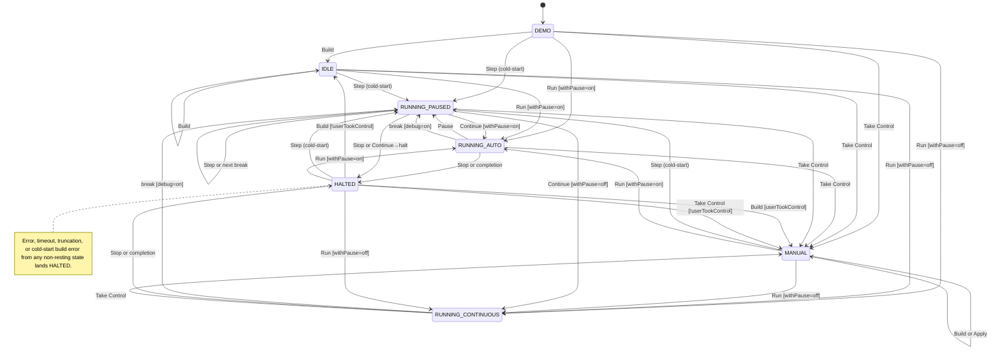
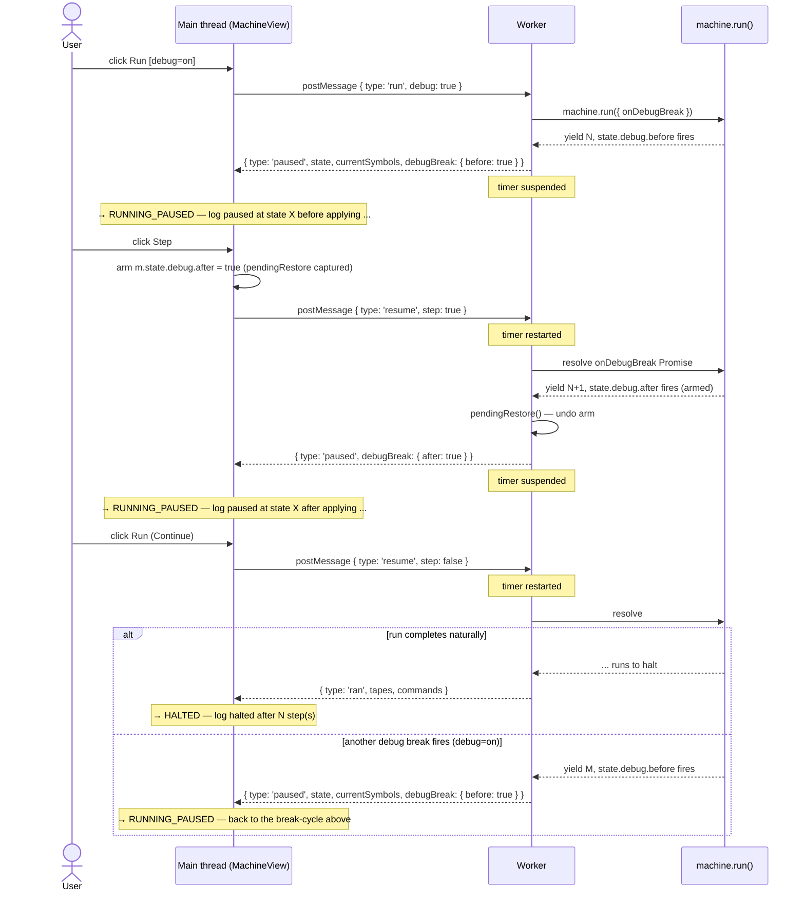

# Execution-model behavioral spec — design

Tracks: [#46](https://github.com/mellonis/machines-demo/issues/46). Blocks [#47](https://github.com/mellonis/machines-demo/issues/47) (test infrastructure).

## Problem

After [#40](https://github.com/mellonis/machines-demo/issues/40) the demo has 7 execution modes (DEMO, MANUAL, RUNNING_STEP, RUNNING_AUTO, RUNNING_CONTINUOUS, RUNNING_PAUSED_AT_BREAK, HALTED) and several user actions interacting with two flags (`debugMode`, `withPause`) plus a halted state and two sticky latches. The Step-semantics churn during #40 happened because the expected behavior was not written down — discussion oscillated through several interpretations across multiple PR revisions.

The spec proposes a 7-mode ideal model — same count, but a different lineup (RUNNING_STEP collapses, IDLE replaces the `demoEnabled` flag). See §Modes for the substitution.

This spec design captures *what the behavioral reference doc will look like* — its location, structure, scope, and conventions — so the implementation produces a single canonical reference that #47's tests can cite.

The deliverable is the reference doc itself: `docs/execution-model.md`. This design captures the decisions about that doc.

## Decisions

- **Location: `docs/execution-model.md`.** Standalone reference, neutral name, room for sibling `docs/*.md` files later. Not under `docs/superpowers/specs/` — that's design history, not durable reference.
- **`CLAUDE.md` loses the runtime-behavior sections.** The "Execution modes" table and "Debugger UX (debug mode + breakpoints)" section move to `docs/execution-model.md`. CLAUDE.md keeps build commands, file structure, architectural conventions, and gets a one-line link. Single source of truth; the recent #40 churn would have been worse with two unsynced sources.
- **Write to the ideal model, not today's code.** The spec describes what the system *should* do once known follow-ups land. Today's divergences live in §11 (Current divergences) with tracking-issue links; tests in #47 cite ideal scenario IDs and `it.skip` the divergent ones until they close. A descriptive spec ages poorly: every PR fixing a known bug forces a spec edit, and tests written against today's quirks bake them in.
- **Walk-throughs are boundary cases only; the matrix is exhaustive.** Per [#46 (b)](https://github.com/mellonis/machines-demo/issues/46) — but the matrix table must give every realistic `(action, mode)` cell a stable ID so #47 has full-coverage citations. Walk-throughs add prose only where the path was confusing or contested.
- **Stable scenario IDs.** Format `S-<action>-<from-state>-<flags?>` (lowercase, hyphenated). Each matrix cell and each walk-through carries one. Tests grep `\bS-[a-z-]+` to find every spec citation. Renames break test-to-spec links, so prefer adding new IDs over renaming.
- **DEMO, IDLE, and MANUAL get dedicated sections, not matrix columns.** All three are non-running resting states; their action sets differ (Apply is MANUAL-only; Take Control hides once `userTookControl` is true; the auto-loop runs only in DEMO). These differences read more naturally as prose than matrix columns. The matrix focuses on in-motion behavior; idle/halted paths live in their own sections.
- **`IDLE` mode replaces the `demoEnabled` flag.** "DEMO with `demoEnabled=false`" is functionally a different state — no auto-loop, user is uncommitted (hasn't clicked Take Control), but they've signaled intent. Encoding it as a mode name (IDLE) eliminates the flag and fixes a latent quirk where Step from DEMO completes back to a still-running auto-loop that overwrites the user's result.

## Deliverable outline (`docs/execution-model.md`)

```
1. Overview                — includes master mode-transition diagram
2. Mode reference          — vocabulary cards for all 7 modes
3. Flag reference          — debugMode, withPause, halted, userTookControl
4. DEMO mode               — auto-loop, single exit-on-intent, exits to IDLE / MANUAL
5. IDLE mode               — uncommitted resting state; Apply hidden; cold-start origin
6. MANUAL mode             — committed resting state; Apply enabled; cold-start origin
7. Cold-start and resume   — Build / Step / Run from IDLE/MANUAL/HALTED (cold-start, includes flowchart); Continue from PAUSED (resume)
8. Action matrix           — RUNNING_AUTO, RUNNING_CONTINUOUS, RUNNING_PAUSED
9. HALTED mode             — Build/Step/Run = §7; Take Control → MANUAL [!userTookControl]
10. Scenario walk-throughs — boundary cases; walk-through 1 or 2 includes paused-cycle sequence diagram
11. Current divergences from spec — punchlist with tracking-issue links
12. Engine quirks          — appendix; upstream behaviors the spec encodes
13. Cross-references
```

Three Mermaid diagrams orient the reader: a master state diagram in §1, a cold-start flowchart in §7, a paused-cycle sequence diagram in §10. The matrix remains the canonical detail; diagrams are for shape, not lookup. Concrete Mermaid blocks are below in §Diagram shapes.

## Modes (ideal model — 7 modes)

`DEMO`, `IDLE`, `MANUAL`, `RUNNING_AUTO`, `RUNNING_CONTINUOUS`, `RUNNING_PAUSED`, `HALTED`.

Two collapses / introductions vs today's code:

- **`RUNNING_STEP` collapses into `RUNNING_PAUSED`.** All running modes use `run()`, so a click-pause from `RUNNING_AUTO` suspends inside run-mode (the throttled `setTimeout`) and lands in the same paused state used by debug breaks. The button label stays "Pause" vs "Step" depending on context, but there is one paused state. (Today RUNNING_STEP exists because RUNNING_AUTO uses the legacy `runner.step()` path; tracked in #43.)
- **`IDLE` is introduced** as the post-interaction, pre-take-control resting state. Today encoded as `(DEMO mode, demoEnabled=false)`. The mode name encodes the latch directly, removes the flag, and absorbs the latent-quirk fix described above. Implementation tracked alongside #46.

## Mode reference shape

Each mode gets a short card:

```markdown
### MANUAL
The user is driving the machine via Apply. Worker is built but idle (no run/step pending). `userTookControl` is true.
Entry: Take Control from DEMO / IDLE / any RUNNING_* / HALTED; post-RUNNING_* completion or Build from HALTED lands MANUAL when userTookControl is true.
Exit: Step / Run via §7 cold-start (→ RUNNING_AUTO / RUNNING_CONTINUOUS / RUNNING_PAUSED), Build (→ MANUAL, reload), Apply (stays MANUAL).
```

Three lines per mode: **what it means**, **how it's entered**, **how it's exited**. UI / log detail belongs in the matrix or walk-throughs. The 7 cards together fit on roughly one screen.

## Flag reference shape

Each flag gets one line:

```markdown
- **debugMode** — `boolean`. UI checkbox, persisted to `localStorage:<engine>:debugMode`. Gates whether user-authored `state.debug` / `haltState.debug` breaks pause execution. Mid-run toggle pushes `setDebug(on)` to the worker.
- **withPause** — `boolean`. UI checkbox + interval input. Selects RUNNING_AUTO (with throttle) vs RUNNING_CONTINUOUS (snap-to-final) on the next Run. The toggle itself (`S-withpause-toggle`) has no immediate runtime effect; it's read at Run-click time.
- **halted** — `boolean`. Derived from worker `built` / `ran` / `error` responses. Drives the HALTED mode transition.
- **userTookControl** — `boolean`. Sticky latch, starts `false`, set `true` on Take Control click, never re-enables. Marks the "manual track": after RUNNING_*/HALTED, post-action mode resolution lands MANUAL when true, IDLE when false.
```

The `demoEnabled` flag from today's code is dropped — the DEMO ↔ IDLE mode distinction encodes it. `userTookControl` remains because both IDLE and MANUAL can host RUNNING_* and HALTED, so the spec needs to remember which track HALTED resolves to.

## Action matrix shape

Flat table, one row per `(action, flag-context)` pair, columns are the in-motion / paused modes. Cells show `<scenario-id>: <terse outcome>` or `—` for hidden/disabled.

**Matrix scope.** The matrix lists *user-action* exits only. Event-driven transitions — debug break firing, run completion, error, timeout, truncation — are not matrix rows. They appear in three other places: §1's master state diagram (edges), each mode's "Exit" line in §2 Mode reference, and walk-throughs 2 and 7-9. A reader looking only at the matrix should not conclude that, e.g., RUNNING_CONTINUOUS exits only via Stop or Take Control.

| Action | RUNNING_AUTO | RUNNING_CONTINUOUS | RUNNING_PAUSED |
|---|---|---|---|
| **Step (debug=off)** | `S-step-auto-off`: pause label — suspend run loop, → PAUSED | — | `S-step-paused-off`: arm `.after` on next state, resume(step), → PAUSED |
| **Step (debug=on)** | `S-step-auto-on`: pause label — suspend, → PAUSED | — | `S-step-paused-on`: arm `.after`, resume(step), → PAUSED (a user break may interpose first) |
| **Stop** | `S-stop-auto`: terminate, → HALTED | `S-stop-cont`: terminate, → HALTED | `S-stop-paused`: terminate, suppress failHalted, → HALTED |
| **Take Control** | `S-takectl-auto`: latch userTookControl=true, terminate, → MANUAL | `S-takectl-cont`: latch, terminate, → MANUAL | `S-takectl-paused`: latch, terminate, → MANUAL |

Notes:
- Every cell is a mode transition (or `—` for hidden/disabled). Flag-change actions (debug toggle, withPause toggle) live in §3 Flag reference — they don't cause mode transitions, so they don't belong in the matrix.
- **Build is hidden in RUNNING_AUTO / RUNNING_CONTINUOUS / RUNNING_PAUSED** — a pending worker request blocks Build. To rebuild, the user clicks Stop or Take Control first (terminate the worker), then Build is available from HALTED / MANUAL.
- All RUNNING_* paths use `run()`. "Pause" from RUNNING_AUTO suspends inside run-mode (the throttle's setTimeout) and lands in PAUSED — the same paused state used by debug breaks.
- **RUNNING_CONTINUOUS has the same control surface as RUNNING_AUTO** — Stop, Take Control, debug toggle all available. The modes differ only in throttle / animation; the control surface does not become a third axis of difference. Take Control mid-CONTINUOUS can lose the race to completion, but no race produces a broken state: terminate-or-complete are both clean exits.
- Cells stay terse (1 line). The *why* lives in walk-throughs for the cells that need it.
- DEMO, IDLE, MANUAL, HALTED are not matrix columns — they have their own sections (§4, §5, §6, §9).

## Diagram shapes

Three diagrams, each placed in a specific section. They orient the reader; the matrix and walk-throughs remain canonical.

**Constraint: plain Mermaid syntax only.** Do not use the YAML frontmatter `--- config: ... ---` block — GitHub's Mermaid renderer does not support it, and the diagram silently fails to render. Each diagram starts directly with its type declaration (`stateDiagram-v2`, `flowchart TD`, `sequenceDiagram`).

**Avoid `/` in transition labels.** In stateDiagram-v2, `/` is the event/action separator — `Stop / completion` parses as event="Stop", action="completion" and renders the two halves with different styling (the action looks "highlighted"). For alternations (where the slash means "or"), use the literal word `or` (`Stop or completion`). For sequences (where one thing follows another), use an arrow (`Continue→halt`). Reserve `/` for cases where the event/action split is actually intended.

**No HTML tags inside diagrams.** GitHub's renderer is stricter than the Mermaid Live Editor and unreliably supports HTML — most notably `<br/>` inside `participant ... as ...` declarations, `Note over ...` blocks, and (sometimes) edge labels. Keep labels and notes on a single line. If a label is long, prefer breaking the diagram into smaller pieces or using punctuation (`—`, `;`, `,`) inline. Don't depend on HTML rendering anywhere in the diagram source.

**No `classDef` colors with light fills.** GitHub renders Mermaid diagrams against the user's chosen theme (light/dark) but does not adapt custom node fills. Light pastel fills (e.g. `#f0fdf4`) become unreadable on dark mode — node text disappears against the near-white background. Either use Mermaid's default (theme-adaptive) styling — which is what we do — or, if a class-based color scheme is necessary, use medium-saturation colors that have enough contrast against both light and dark themes (and verify on both before committing).

### 1. Master mode-transition diagram (§1 Overview, deliverable)

All 7 modes; every action labeled, conditions inline. Reader sees the whole shape on one screen.



### 2. Cold-start flowchart (§7)

Captures the branching when user clicks Build / Step / Run from IDLE, MANUAL, or HALTED (and DEMO, which uses the same paths but with `userTookControl=false`). The "Build" branch resolves to IDLE or MANUAL by `userTookControl`. If `Reload` fails (build error in user code), → HALTED with error logged; covered by walk-through 7.

```mermaid
flowchart TD
    Start([User clicks Build, Step, or Run from IDLE / MANUAL / HALTED])
    Start --> Reload[reload worker — build, mirror, alphabets]
    Reload --> Action{which action?}
    Reload -. build error .-> ErrorOut[→ HALTED with error log]
    Action -->|Build| Resolve1{userTookControl?}
    Resolve1 -->|true| ManualOut[→ MANUAL]
    Resolve1 -->|false| IdleOut[→ IDLE]
    Action -->|Step| ArmAfter[arm initialState.debug.after = true; preserve user-authored .before]
    ArmAfter --> RunStep[runner.run debug=debugMode, step=true]
    RunStep --> PauseOut[→ RUNNING_PAUSED at iter 1 after-fire]
    Action -->|Run| WithPause{withPause?}
    WithPause -->|true| RunAuto[runner.run debug=debugMode, with throttled onStep]
    RunAuto --> AutoOut[→ RUNNING_AUTO]
    WithPause -->|false| RunCont[runner.run debug=debugMode, no throttle]
    RunCont --> ContOut[→ RUNNING_CONTINUOUS]
    AutoOut -. user-authored break .-> PauseOut
    ContOut -. user-authored break .-> PauseOut
    RunStep -. user-authored .before fires before iter 1 after .-> PauseOut
```

### 3. Paused-state cycle sequence diagram (§10, walk-through 1 or 2)

Main thread ↔ worker messages across a Step then Continue cycle. Per-segment timer behavior is annotated.



## Cold-start (§7)

Build / Step / Run from IDLE, MANUAL, or HALTED. The path is identical across all three origins, so it's documented once and cited from each. Each entry carries an ID:

- `S-build-idle` / `S-build-manual` / `S-build-halted` — reload, build worker, → IDLE (origin IDLE; HALTED with `!userTookControl`) or MANUAL (origin MANUAL; HALTED with `userTookControl`).
- `S-step-idle-{off,on}` / `S-step-manual-{off,on}` / `S-step-halted-{off,on}` — reload, arm `initialState.debug.after = true` (preserving any user-authored `state.debug.before`), enter run-mode, → RUNNING_PAUSED at iter 1's after-fire.
- `S-run-idle-{off,on}-{cont,auto}` / `S-run-manual-{off,on}-{cont,auto}` / `S-run-halted-{off,on}-{cont,auto}` — reload, run-mode, → RUNNING_AUTO (withPause=on) or RUNNING_CONTINUOUS (withPause=off). Debug=on may pause at user breaks, → RUNNING_PAUSED.

**Post-RUNNING_* completion** lands `IDLE` when `!userTookControl`, `MANUAL` when `userTookControl` — the track is preserved across the run.

**DEMO → cold-start** uses the same paths but lands IDLE post-action (since `userTookControl` is false in DEMO and the click itself doesn't set it). Scenario IDs `S-build-demo`, `S-step-demo-{off,on}`, `S-run-demo-{off,on}-{cont,auto}` mirror the IDLE entries.

## Apply scenarios (§6)

Apply is meaningful only in MANUAL — the only mode where the panel is enabled and a click writes to the mirror. One scenario:

- `S-apply-manual` — main thread applies the user-composed `Command` to `mirrorMachine` via the `ifOtherSymbol` one-step state. No worker round-trip; the worker stays idle. Mode stays MANUAL.

The Apply button is **hidden** in DEMO, IDLE, and HALTED (no `S-apply-*` scenario IDs exist for those modes). The DEMO loop generates commands internally and renders them on the panel without any user-facing Apply button — `S-apply-demo` does not exist.

## Resume from PAUSED (§7, cont'd)

The Run / Continue button (Run while in RUNNING_PAUSED) is the only action with a single-column relevance — it has meaning only from PAUSED. Pulled out of the matrix to keep the matrix focused on multi-column actions:

- `S-continue-paused-off` — `runner.resume({ step: false })`. Worker resumes inside `run()`. Debug breaks are not honored (debug=off), so the run continues to halt → HALTED on completion (or to the run-mode end via Stop / error / timeout).
- `S-continue-paused-on` — `runner.resume({ step: false })`. Debug breaks fire as encountered, → next PAUSED. Continues across multiple paused/resume cycles until halt or the user clicks Stop.

The button label is "Run" when entering from non-PAUSED modes (cold-start) and "Continue" when in PAUSED — same underlying action class, different label for clarity. Walk-through 3 expands these scenarios with per-segment timer behavior, log replay, and edge cases; this sub-section is the canonical scenario-ID list, walk-through 3 is the prose.

## Walk-through shape

Each walk-through opens with a heading using its scenario ID(s) as the anchor:

```markdown
### `S-step-paused-off` / `S-step-paused-on` — Step from break

**Sequence**
1. User clicks Step while in RUNNING_PAUSED.
2. Main thread arms `.after` on the relevant state — `m.state` if paused at before, `m.nextState` if paused at after.
3. `runner.resume({ step: true })` resolves the worker's pending Promise.
4. Worker un-applies `pendingRestore` from the previous arm (if any), runs until the next `.after` fire.
5. Worker sends `paused`; main thread enters RUNNING_PAUSED with the new break info.

**Log entries**
- `paused at state <X> after applying command for symbols: [<syms>]`

**Worker calls**
- `resume({ step: true })`

**Edge cases**
- debug=on: a user-authored `.before` may interpose before the armed `.after` fires. Both produce a normal `paused` response; the long-format log line distinguishes them by `before` vs `after`.
- The halting iter's armed `.after` never fires — see §11 (current divergences) / turing-machine-js#108.
```

Standard sub-sections: **Sequence** (numbered steps), **Log entries** (verbatim text), **Worker calls** (request types), **Edge cases** (variants and quirks).

The 9 walk-throughs:

1. Step from PAUSED (`S-step-paused-{off,on}`)
2. Run with breakpoints — multiple paused/resume cycles, per-segment timer behavior
3. Continue from break (`S-continue-paused-{off,on}`)
4. Stop from each running mode (`S-stop-{auto,cont,paused}`)
5. debug toggle mid-run (`S-debug-toggle-{auto,cont,paused}`)
6. Take Control from any RUNNING_* (`S-takectl-{auto,cont,paused}`)
7. Error mid-run (`S-error-{auto,cont,paused}`)
8. Truncation (`S-truncate-{auto,cont}`)
9. Worker timeout per segment (`S-timeout-{auto,cont,paused}`)

## Current divergences from spec (§11)

A punchlist of where today's code differs from the spec, each with a tracking-issue link. Acts as a TODO list for future PRs:

- **IDLE mode does not exist.** Today's code encodes the post-Build, pre-Take-Control resting state via `(executionMode = DEMO, demoEnabled = false)`. Affects all `S-*-idle-*` IDs — they're served by `S-*-demo-*` paths today. Also: Step from DEMO completes back to a still-running auto-loop that overwrites the result. Implementation tracked alongside #46 (this spec); follow-up PR aligns code by introducing the IDLE mode and dropping the `demoEnabled` flag.
- **RUNNING_STEP exists as a separate paused state.** Affects `S-step-auto-{off,on}` (today: → RUNNING_STEP, not PAUSED), and any `S-step-step-*` / `S-run-step-*` IDs that exist only as legacy citations. Tracked in [#43](https://github.com/mellonis/machines-demo/issues/43).
- **Today's code names the paused-mode `RUNNING_PAUSED_AT_BREAK`.** The spec uses the shorter `RUNNING_PAUSED` (consistent with `RUNNING_AUTO` / `RUNNING_CONTINUOUS`, and accurate when PAUSED arises from a click-pause rather than a debug break). Cosmetic rename, folded into the same alignment work as the RUNNING_STEP collapse (#43).
- **Auto-step path uses `runner.step()`, not `run()`.** Affects all `S-step-auto-*`, `S-debug-toggle-auto` (today: flag only, no `setDebug()` call). Tracked in [#43](https://github.com/mellonis/machines-demo/issues/43).
- **Step (debug=on) on auto-step path doesn't honor breaks.** Affects `S-step-auto-on`. Tracked in [#43](https://github.com/mellonis/machines-demo/issues/43).
- **Halting iter's `state.debug.after` never fires.** Affects walk-through 1 edge case. Tracked in [turing-machine-js#108](https://github.com/mellonis/turing-machine-js/issues/108).
- **`haltState.debug.after` silently ignored; `haltState.debug.before` IS honored.** Tracked in [turing-machine-js#108](https://github.com/mellonis/turing-machine-js/issues/108).

## Engine quirks (§12)

Upstream behaviors the spec *encodes* (won't change without an upstream major version, so the spec works with them):

- `onDebugBreak` after-fire payload substitutes `m` to `prevYield` — the un-substituted `machineState` is not exposed. Affects step-over-from-after implementations (cross-ref [turing-machine-js#107](https://github.com/mellonis/turing-machine-js/issues/107)).
- `onStep` and `onDebugBreak` after-fire payloads carry semantically identical `MachineState`. Both hooks are documented; the demo wires both for orthogonal reasons (per-step buffer vs pause cycle). Cross-ref [turing-machine-js#109](https://github.com/mellonis/turing-machine-js/issues/109).

§11 vs §12: §11 lists demo-side gaps to be closed; §12 lists engine semantics that won't change. Items can move from §12 to §11 if the upstream issue lands and a corresponding demo-side simplification becomes possible.

## Cross-references (§13)

- `CLAUDE.md` — working conventions, file structure, build commands. Runtime behavior moved here.
- `docs/superpowers/specs/2026-05-08-worker-run-mode-design.md` — the #40 design; gives the *why* behind RUNNING_PAUSED and the worker contract.
- [#47](https://github.com/mellonis/machines-demo/issues/47) — test infrastructure that consumes the scenario IDs.
- [#46](https://github.com/mellonis/machines-demo/issues/46) — issue this spec resolves.

## CLAUDE.md change (same PR)

- Strip the "Execution modes" table (~30 lines).
- Strip the "Debugger UX (debug mode + breakpoints)" section.
- Replace both with a one-liner: `**Execution model and debugger semantics:** see [`docs/execution-model.md`](docs/execution-model.md).`
- Keep build commands, file structure, the architecture/conventions sections.

## Scenario ID grammar

`S-<action>-<from-state>-<flags?>`

| Slot | Values |
|---|---|
| `S-` | literal prefix; marks the token as a scenario reference |
| `<action>` | `build`, `step`, `run`, `continue`, `stop`, `takectl`, `apply`, `debug-toggle`, `withpause-toggle`, `error`, `truncate`, `timeout` |
| `<from-state>` | `demo`, `idle`, `manual`, `auto`, `cont`, `paused`, `halted` (and `step` only in §11 for legacy RUNNING_STEP citations) |
| `<flags?>` | optional flag suffix(es); `on` / `off` (debug), `auto` / `cont` (withPause when ambiguous), or compound like `off-auto` |

Conventions:
- Lowercase + hyphen throughout. No shift key, easy to grep.
- One token per slot. Don't run flags together.
- Drop slots that don't matter — uniform behavior across flags ⇒ no flag suffix.
- Stable across spec edits — prefer adding new IDs over renaming.
- `S-` prefix is fixed. Tests grep for `\bS-[a-z-]+`.

Where IDs live:
- **Matrix cells:** `S-step-paused-off: arm .after, resume(step), → PAUSED`. Text after `:` is the one-line outcome.
- **Walk-throughs:** each opens with `### `S-step-paused-off` / `S-step-paused-on` — Step from break` so the ID is the section anchor.
- **Tests (#47):** each `it()` cites at least one ID via a comment or string token. Failing tests point straight at the spec rule they broke.
- **§11 entries:** cite the IDs they affect.

## Out of scope

- Changing behavior. This is documentation of what the code should do; demo-side changes to align today's code with the spec are tracked separately (#43, etc.).
- Tests — tracked in #47, blocked on this spec.
- Visual representation of the state graph (#9, #10) — Wave 4 deferred.
- Click-to-toggle breakpoints UI (#37) — Wave 4 deferred.

## Self-review

Run after writing the deliverable:

1. **Placeholder scan.** No "TBD", "TODO", incomplete sections.
2. **Internal consistency.** Mode reference vocabulary matches matrix column headers; walk-through scenario IDs match matrix cells.
3. **Scope check.** Single deliverable, single implementation plan.
4. **Ambiguity check.** Each cell's outcome and each walk-through's sequence is unambiguous.

Fix inline; no second review pass.
